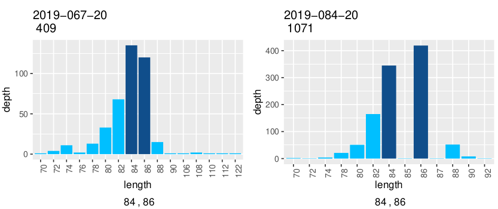
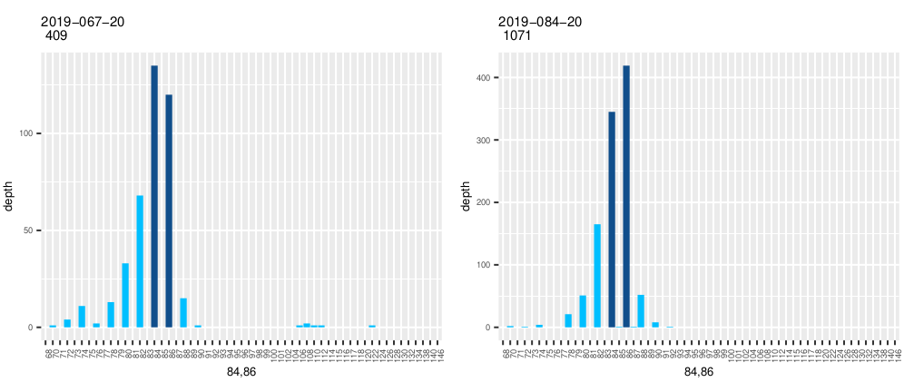

# MEGASAT_MplotR_mod
Modified version of MEGASAT (beiko-lab/MEGASAT)'s Mplot.R script

A modified version of the Mplot.R script from beiko-lab/MEGASAT tool.
This modified version produces histograms with bins for all (potential) alleles found for a marker.
The original version only displays bins for which there were fragment length counts in that particular sample.
Modified version is run as the same way as the original.

Plot generated using the original Mplot.R script:

Plot generated using the modified Mplot.R script.
The increased number of bins reflect every fragment length detected for this marker.

